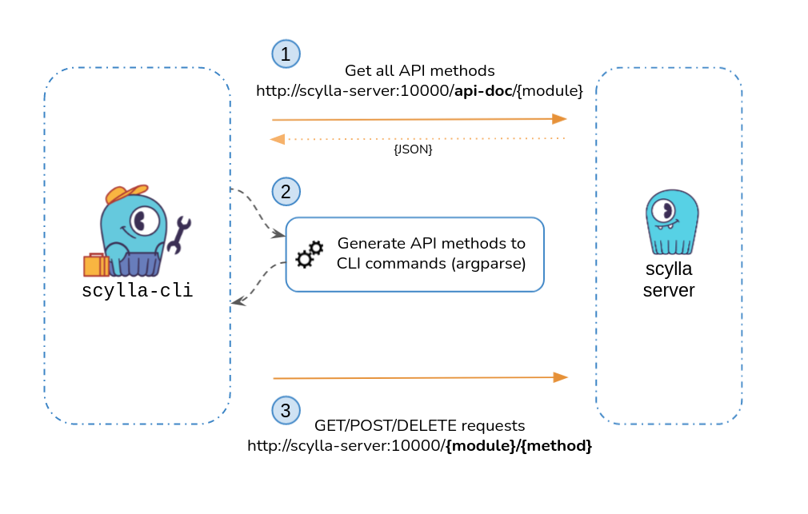

# Scylla-API
Scylla API is a command line utility implementing a thin client directly utilizing the Scylla REST API


## Requirements
* python > 3.8
* requests
* pytest (developers)


## Usage
Make sure you have all the [required](#Requirements) packages,
You can install them in a separate environment by venv:
```
python3 -m venv .venv
source .venv/bin/activate
pip3 install -r requirements.txt
```

See `./scylla.py --help` for all options, below are some sample uses:

* Show all API modules
    ```
    $ ./scylla.py --list-modules
    system
    compaction_manager
    gossiper
    endpoint_snitch_info
    storage_proxy
    column_family
    stream_manager
    messaging_service
    storage_service
    cache_service
    failure_detector
    hinted_handoff
    lsa
    commitlog
    collectd
    error_injection
    ```

* Show all API commands for specific module _system_
    ```
    $ ./scylla.py --list-module-commands system
    system/logger:
    GET: Get all logger names
    POST: Set all logger level
    system/drop_sstable_caches:
    POST: Drop in-memory caches for data which is in sstables
    system/uptime_ms:
    GET: Get system uptime, in milliseconds
    system/logger/{name}:
    GET: Get logger level
    POST: Set logger level
    ```

* Get loglevel for specific logger _httpd_
    ```
    $ ./scylla.py system/logger/{name} GET --name httpd
    "info"
    ```

* Set loglevel _level=debug_ for specific logger _httpd_
    ```
    $ ./scylla.py system/logger/{name} POST --name httpd --level debug
    ```


## Tests
pytest is used for writing and executing tests
to run tests you can execute:
```
pytest -s -v tests/
```


## Design


